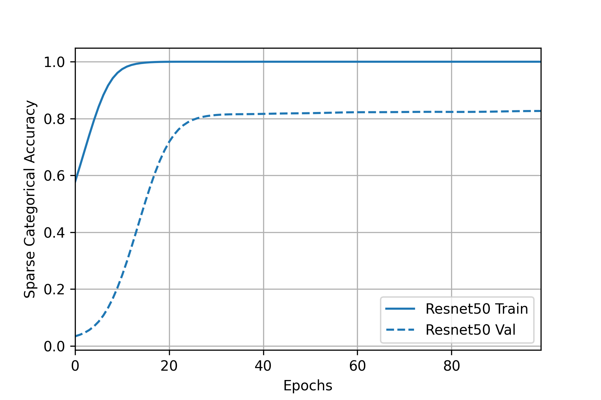
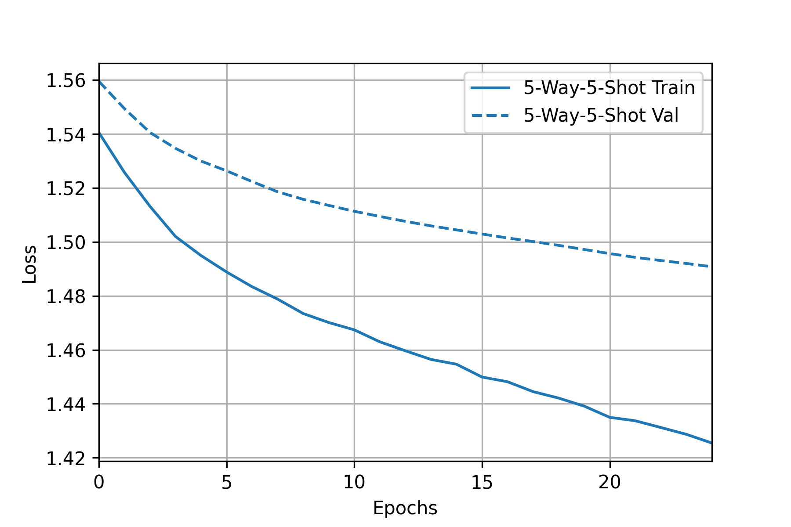
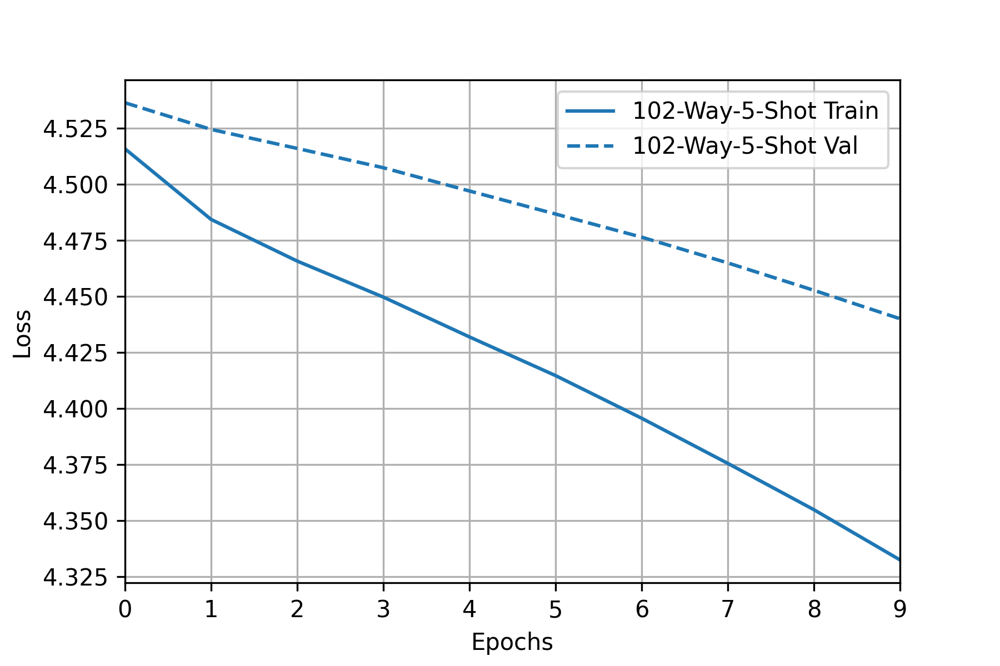
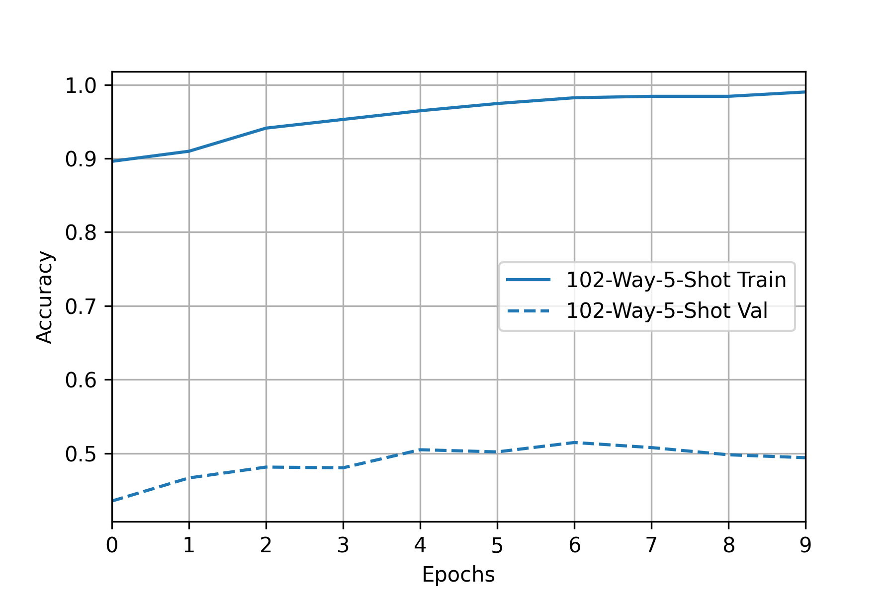

## Task 1: Fine-tune on ​​previously published architectures
In this section, we choose three previously published models (`VGG-16`, `ResNet-50`, and `DenseNet-201`), which were pretrained on `ImageNet`, and perform a fine-tuning on `Oxford Flowers 102` dataset.

The reason why we choose these three models is that they represent a series of modern CNN progression in aspect of architecture and depth: `ResNet-50` can be thought as a deeper `VGG-16` with residual connection and `DenseNet-201` can be thought as a deeper `ResNet-50` with full residual connection.

### The intuition of fine-tuning
If a model is trained on a large and general enough dataset, this model will develop great ability to extract the features of an image, and will effectively serve as a generic model of the visual world. In this task, our dataset only contains about 8,000 samples in total, which is quite small compared with other larger datasets. Instead of training a model from scratch, we might reuse those learned feature maps to perform a task on our smaller dataset.

### Data preparation
- **Source** The dataset is fetched using [`tensorflow_datasets`](https://www.tensorflow.org/datasets/catalog/oxford_flowers102).
- **Split** For simplicity, we split the whole dataset into (`train`, `val`, `test`) = (1020, 1020, 6149) formmat, which means we merged the validation set into train set.
- **Balance** Each category has 10 samples in `train` and `val` set, and at least 20 samples in `test` set. The `train` set is well balanced.
- **Resize** To be consist with original papers, we choose image size `img_sz` to be `224`, which is widely used in experiments on ImageNet. The images are resized into `224*224` with **scaling reserved** and **padded** with 0s.
- **Normalization** Since the `Oxford Flowers 102` is much smaller than `ImageNet` and our models were pretrained on `ImageNet`, the normalization is done with the statistics (`pixel_mean`, `pixel_std`) of `ImageNet`. Each image is subtracted by `pixel_mean` and divided by `pixel_std`.
- **Augmentation** We didn't perform any augmentation on `train` set.
  
### Models
We use three pretrained models in our experiment. All three models are downloaded from [`tensorflow.keras.applications`](https://www.tensorflow.org/api_docs/python/tf/keras/applications) and removed the classification layer. The model serves as `backbone` and is appended a `GlobalAveragePooling2D` layer, a `Dense` layer of `102` neurons with `ReLU` activation, and finally a `Softmax` layer. Which in general is 
> `backbone`->`GlobalAveragePooling2D`->`Dense(ReLU)`->`Softmax`

The other possible architecture is to replace the `GlobalAveragePooling2D` with a `Flatten` layer, however, it doesn't improve the performance in our experiments and increase the model complexity.

### Experiment & Training
We use `sparse_categorical_crossentropy` as loss function and apply the `SGD` optimizer with learning rate equals `0.01`. We ran `100` epochs on each model with an `EarlyStop` and patience equals `10`. We didn't use any normalization (e.g. l1, l2) in this experiment.

### Results and analysation

|       Metric\backbone        |             VGG16           |             ResNet50           |            DenseNet201
:--------------------:|:----------------------------:|:--------------------------------:|:------------------------------------:
| trainable params |           14,767,014          |      23,743,590                 |                 18,288,870                   
|       train loss          | |  |  
|       train accuracy       |  |   |    
|       test accuracy       | 69.7%  |  75.0% |  79.2%      

- **Performance**
  
  `DenseNet201` > `ResNet50` > `VGG16`, the deeper models (although there might be less params) outperform the shallower models. Modern CNN networks tend to be deeper instead of wider and it is believed that deeper models are able (or have higher possibility) to fit more complex functions and get better performance.

  All three models have overfitting probelms, the severity: `VGG16` > `DenseNet50` ≥ `ResNet50`, in this experiment we didn't perform any normalization method (except model itself) to avoid overfitting.

- **Trainability**
  
  `DenseNet201` ≥ `ResNet50` > `VGG16`, the models with residual connection have a smoother training curve meanwhile `VGG16` training curve is shaper and earlystopped around `60` epochs. The instroduction of residual connetion solved the vanishing gradient problem, which is widly used in modern CNN network. What's more, `BatchNormalizasion` (used in `DenseNet` and `ResNet`) also helps to solve the problem.

- **Complexity/Time for forward propogation & backward propogation**

  `DenseNet201` > `ResNet50` > `VGG16`, `VGG16` is the "simplest" model here since it has the least layers and parameters. `ResNet50` introduced more layers and residual connection. `DenseNet201` has much more layers and residual connection. 
  
  Although `DenseNet201` has less params than `ResNet50`, it has an `O(n^2)` residual connetion compared with `O(n)` of `ResNet50`, which greatly increases computational complexity.
  
## Task 2: Few-shot learning using part of the dataset

In this section, we use `VGG-16` as a backbone and perform `5-way-1-shot`, `5-way-5-shot`, `102-way-1-shot`, `102-way-5-shot` learning on `Oxford Flowers 102` dataset and analyse the result.

### The intuition of few-shot learning
Machine learning alrothims (neural networks, for example) are often hampered when they are not "fed" with enough data. Some data are difficult and expensive to collect or it is impossible to collect enough samples. Few-shot learning (FSL) is proposed to tackle this problem. Using prior knowledge, FSL can rapidly generalize to new tasks containing only a few samples with supervised information. (Wang, 2019).

### Data preparation
`k`-way-`n`-shot dataset: A dataset contrains `k` classes, each classes has `n` random samples. For example, the `train` set is a 102-way-10-shot dataset.

In our experiment `k` classes are classes from `[0, k)` for simplicity, a discrete sampling can be easily achieved by relabeling the whole dataset.

### Methodology
- **Basic idea**

  Given an `img`, we can pass it through `feature_extractor` and get its feature vector `v`, which is a `p`-dimension vector and `p` is determined by the model. 
  
  Given `k` (number of classes) such vector, we can calculate the angle between `v` and `k` vectors, which is measured using `cos` value. The value can be calculated easily by multiplying the unit vector (l2 normalization) of two vectors. The predicted class is the class with highest `cos` value. (IMGGGGG)

  Given a `k`-way-`n`-shot dataset, we can get the feature vector for each sample, the feature vector of class `i` can be represented by the mean of feature vectors in class `i`. And we can get an matrix `W` of `k*p`. The `cos` distance of `img` against all classes can be calculated by `W*p`.

  Using a `Softmax` layer, we can convert the `cos` distance into possibility and make the prediction.

- **Fine-tuning** and **Support-based initialization**
 
  In the basic idea the `W` matrix is untrainable. To achieve better performance we can replace the `W` matrix with a `Dense` layer, whose weight is initialized with `W` and bias is initialized with `0`s. After introduing the `Dense` layer we can fine-tune both classification layer and the `feature_extractor`.

### Model
Inspired by (Dhillon, 2019), we use a similar architecture: Given a pre-trained model `feature_extractor` (backbone in origial paper), apply a `ReLU` on logits, and then append a new fully-connected layer `Dense`. Which in general is
> `feature_extractor`->`ReLU & Flatten`->`Dense`->`Softmax`

We chosse `VGG-16` as the `feature_extractor` since it has smaller size, good trainabiliy and acceptable performance. 

### Experiment & Training
We perform experiments of `5-way-1-shot`, `5-way-5-shot`, `102-way-1-shot`, `102-way-5-shot` using `VGG-16`. For each experiment, We use `sparse_categorical_crossentropy` as loss function and `Adam(W)` optimizer with learning rate equals `5e-5`, and `weight_decay` of `0`, `7e-3`, `7e-3`, `1e-4` respectively, trained `100` epochs and record the best model. 

### Results and analysation

|       Metric        |             5-way-1-shot           |             5-way-5-shot           |            102-way-1-shot     | 102-way-5-shot        |
:--------------------:|:----------------------------:|:--------------------------------:|:------------------------------------:|:---------------------:|
| train set size    |   5/1020 | 25/1020 | 102/1020 | 510/1020
| test set size | 161/6149 | 161/6149 | 6149/6149 | 6149/6149
| performance without fine-tuning|    65.2%/80.1%(top2)   | 72.0%/89.9%(top2) | 18.7%/38.0%(top5) | 43.6%/65.8% (top5)
|        loss          | |  |   |  |
|       accuracy       |  |   |       |  |
| performance after fine-tuning|    55.3%/73.3%(top2)     | 79.5%/88.8%(top2) | 21.9%/45.2%(top5) | 55.6%/80.4%(top5) 
| does fine-tuning improve? | -9.9%   |  7.5%  |  3.2%  |  12%

- **Peformance**
  
  5-way-n-shot learning are able to achieve above `65%` accuracy, however 102-way-n-shot only achieves around `55%` even though we used half of `train` set. It's obvious that performance gets worse when we have more classes since the problem becomes harder and performance gets better when we have more training samples.

- **Fine-tuning** and **overfitting**
  
  Except for `5-way-1-shot` learning, the accuracy after fine-tuning increases from 3.2% - 12%. The fine-tuning performance tends to be better when we have more shots (i.e. more samples). In `5-way-1-shot` experiment, the model overfits a lot and the accuracy even drops after fine tuning.
  

## Task 3: Visual prompt tuning on a vision transformer

In this section, we use `vit_b16` as a backbone, fine-tune it using visual prompt tuning on `Oxford Flowers 102` dataset and analyse the result.

### The intuition of fine-tuning

Visual prompt tuning is a new tuning method introduced by `Jia, M.` in 2012. She took inspiration from recent advances in efficiently tuning large language models (prompt tuning) and introduced only a small amount (less than 1% of model parameters) of trainable parameters in the input space while keeping the model backbone frozen, which greately reduced the time and space to fine-tune a huge model.

Notice that in our experiment we only tried a subset of visual propmt tuning (i.e. only `concatenate` the prompt with model inputs and didn't use the `add` method)

### Data preparation

Same as Task 1.

### Methodology
- **Prompts**
  
  Instead of tuning the whole model, we freeze the whole model and introduce a trainable prompts matrix `P`. 

  The inputs of original `vit_b16` transformer layers can be represented as [`x`, `E`], where `x` is class embedding and `E` are image patch embeddings, `x` is `d*1` and `E` is `d*k`, where `d` is determined by model and `k` is the number of patches. We introduce a `d*p` trainable parameters `P`, concatenate it with [`x`, `E`] and form new inputs [`x`, `P`, `E`].

- **shallow** and **deep** visual prompt tuning
  
  For shallow prompt tuning, we only add prompts before the first transformer layer. Only `P` are the trainable parameters we introduce.

  > [`x`, `P`, `E`]->transfomer1->[`x'`, `P'`, `E'`]->transformer2->...

  For deep prompt tuning, for each transformer layer, we append a prompt matrix (`Pn`) before it and cut off the corresponding dimensions after it.

  > [`x`, `P1`, `E`]->transfomer1->[`x'`, `_`, `E'`]->[`x'`, `P2`, `E'`]->transformer2->...

### Model
Following the original papaer, we adapt a vision transformer base patch 16 (`vit_b16`) from [this repo](https://github.com/faustomorales/vit-keras/blob/28815edc5c24492612af726d1b2ca78295128d84/vit_keras/vit.py), load with the weights pretrained on `ImageNet`. 

We used both `shallow` and `deep` tuning, where both `p`s (the second dimension of prompt vector) are equal to `5`. 

### Experiment & Training

We use `sparse_categorical_crossentropy` as loss function and apply the `SGD` optimizer with learning rate equals `0.01`. We ran `100` epochs on each model with an `EarlyStop` and patience equals `10`. We didn't use any normalization (e.g. l1, l2) in this experiment.

### Results and analysation

|       Metric        |             vit_b16-shallow           |             vit_b16-deep           |
:--------------------:|:----------------------------:|:--------------------------------:|
| trainable/total params |  82,278/85,880,934   |  124,518/85,923,174   |
|        loss          | |  |
|       accuracy       |  |   |  
|       test accuracy       | 82.1%  |  74.7% |

## Task 4: More advanced loss function
