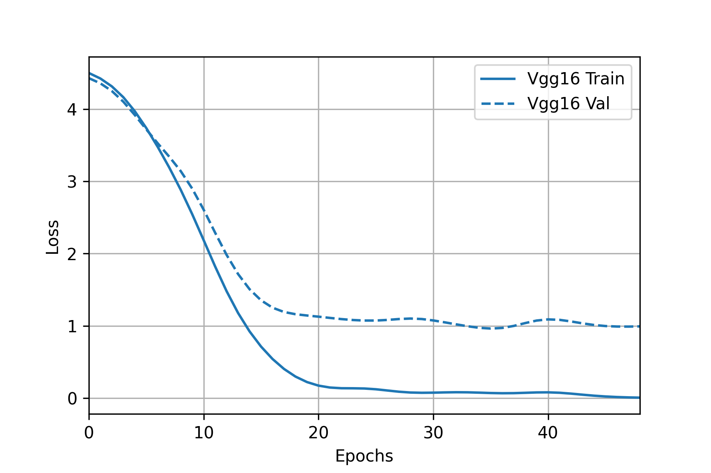
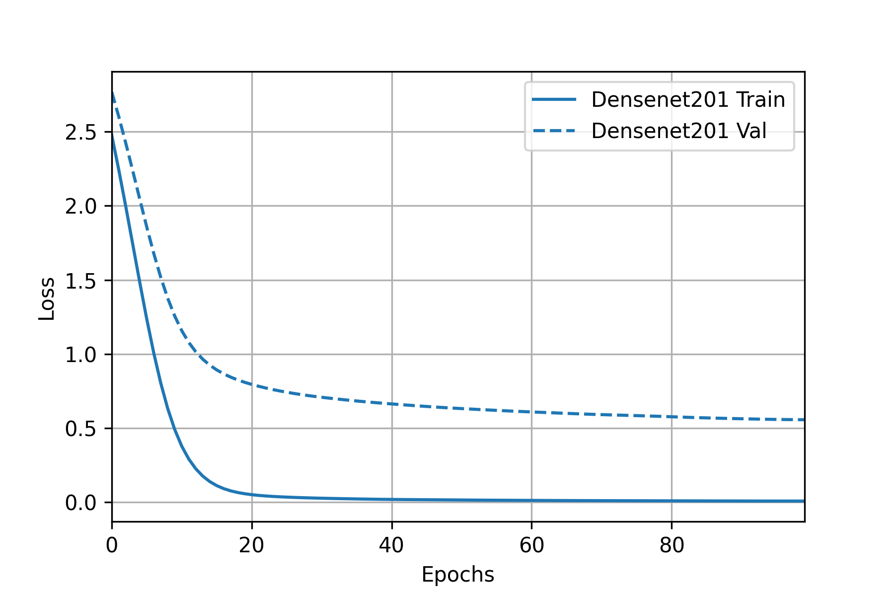
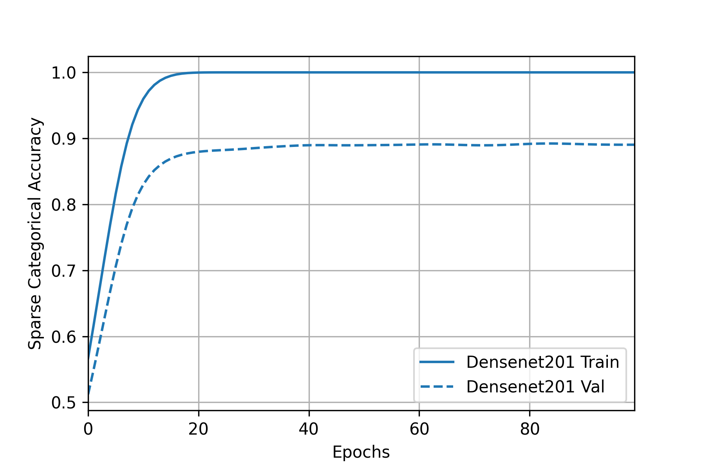

## Task 1: Fine-tune on ​​previously published architectures
In this section, we choose three previously published models (`VGG-16`, `ResNet-50`, and `DenseNet-201`), which were pre-trained on `ImageNet`, and perform a fine-tuning on `Oxford Flowers 102` dataset.

The reason why we choose these three models is that they represent a series of modern CNN progression in aspects of architecture and depth: `ResNet-50` can be thought as a deeper `VGG-16` with residual connection and `DenseNet-201` can be thought as a deeper `ResNet-50` with full residual connections.

### The intuition of fine-tuning
If a model is trained on a large and general enough dataset, this model will develop a great ability to extract the features of an image, and will effectively serve as a generic model of the visual world. In this task, our dataset only contains about 8,000 samples in total, which is quite small compared with other larger datasets. Instead of training a model from scratch, we might reuse those learned feature maps to perform a task on our smaller dataset.

### Data preparation
- **Source** The dataset is fetched using [`tensorflow_datasets`](https://www.tensorflow.org/datasets/catalog/oxford_flowers102).
- **Split** For simplicity, we split the whole dataset into (`train`, `val`, `test`) = (1020, 1020, 6149) format. Notice that we didin't use `val` set for training.
- **Balance** Each category has 10 samples in `train` and `val` set, and at least 20 samples in `test` set. The `train` set has been well balanced.
- **Resize** To be consistent with original papers as well as reducing calculation and memory comsumption, we choose image size `img_sz` to be `224`, which is widely used in experiments on ImageNet. The images are resized into `224*224` with **scaling reserved** and **padded** with 0s.
- **Normalization** Since the `Oxford Flowers 102` is much smaller than `ImageNet` and our models were pre-trained on `ImageNet`, the normalization is done with the statistics (`pixel_mean`, `pixel_std`) of `ImageNet`. Each image is subtracted by `pixel_mean` and divided by `pixel_std`.
- **Augmentation** We didn't perform any augmentation on the `train` set.
  
### Models
We use three pre-trained models in our experiment. All three models are downloaded from [`tensorflow.keras.applications`](https://www.tensorflow.org/api_docs/python/tf/keras/applications) and removed the classification layer. The model serves as a `backbone` and is appended a `GlobalAveragePooling2D` layer, a `Dropout` layer of `0.25`, a `Dense` layer of `102` neurons with `ReLU` activation, and finally a `Softmax` layer. Which in general is 
> `backbone`->`GlobalAveragePooling2D`->`Dropout(0.25)`->`Dense(ReLU)`->`Softmax`

The other possible architecture is to replace the `GlobalAveragePooling2D` with a `Flatten` layer, however, it doesn't improve the performance in our experiments and increases the model complexity.

### Experiment & Training
We use `sparse_categorical_crossentropy` as the loss function and apply the `SGD` optimizer with learning rate equal to `0.01`. We ran `100` epochs on each model with an `EarlyStop` and patience equal to `10`. 

### Results and analyzation

|       Metric\backbone        |             VGG16           |             ResNet50           |            DenseNet201
:--------------------:|:----------------------------:|:--------------------------------:|:------------------------------------:
| layers | 16 | 50 | 201|
| trainable params |           14,767,014          |      23,743,590                 |                 18,288,870                   
|       train loss          | |  |  
|       train accuracy       |  |   |    
|       test accuracy       | 76.2%  |  79.3% |  86.6%      

- **Performance**
  
  `DenseNet201` > `ResNet50` > `VGG16`, the deeper models (although there might be fewer params) outperform the shallower models. Modern CNN networks tend to be deeper instead of wider and it is believed that deeper models are able (or have a higher possibility) to fit more complex functions and get better performance.

  We also tested the architecture with/without `Dropout` layer and found that the `Dropout` layer can increase the performance from `4.3%` to `6.5%` in all three models.

- **Trainability**
  
  `DenseNet201` ≈ `ResNet50` > `VGG16`, the models with residual connection have a smoother training curve and consistent loss drop meanwhile `VGG16` training curve is shaper and early-stopped around `50` epochs. The introduction of residual connetion solves the vanishing gradient problem, which is widely used in modern CNN networks. Besides, `BatchNormalizasion` (used in `DenseNet` and `ResNet`) also helps to solve the problem.

- **Complexity/Time for forward & backward propagation**

  `DenseNet201` >> `ResNet50` > `VGG16`, `VGG16` is the "simplest" model since it has the least layers and parameters. `ResNet50` introduced more layers and residual connection. `DenseNet201` has much more layers and residual connection, and we found it the most time-consuming during the training.
  
  Although `DenseNet201` has fewer params than `ResNet50`, it has an `O(n^2)` residual connection compared with `O(n)` of `ResNet50`, which greatly increases computational complexity.

- **Overfitting severity**
  
  `VGG16` > `ResNet50` ≥ `DenseNet201`, in this experiment we didn't perform any normalization method to avoid overfitting.  

- **Possible improvement in future work**
  
  All three models have the overfitting problem to some extent. `Dropout` layer might not be enough to reduce overfitting. We might explore more normalization methods (for example l1, l2) in future work.

  It can be noticed that the training curve of `ResNet50` and `DenseNet201` become flat after some epochs. We might implement learning rate schedulers to further tune the model.

  Merge `val` set into `train` set and train the model on it, which might achieve better performance since there are more training samples. Unfortunately we don't have time to do so and it might double the checkpoint files.
  
## Task 2: Few-shot learning using part of the dataset

In this section, we use `VGG-16` as a backbone and perform `5-way-1-shot`, `5-way-5-shot`, `102-way-1-shot`, `102-way-5-shot` learning on `Oxford Flowers 102` dataset and analyze the result.

### The intuition of few-shot learning

Machine learning algorithms (neural networks, for example) are often hampered when they are not "fed" with enough data. Some data are difficult and expensive to collect or it is impossible to collect enough samples. Few-shot learning (FSL) is proposed to tackle this problem. Using prior knowledge, FSL can rapidly generalize to new tasks containing only a few samples with supervised information. (Wang, 2019).

### Data preparation

`k`-way-`n`-shot dataset: A dataset contains `k` classes, each classes has `n` random samples. For example, the `train` set is a 102-way-10-shot dataset.

In our experiment `k` classes are classes from `[0, k)` for simplicity, a discrete sampling can be easily achieved by relabeling the whole dataset.

### Methodology
- **Basic idea**

  Given an `img`, we can pass it through `feature_extractor` and get its feature vector `q`, which is a `p`-dimension vector and `p` is determined by the model, normalize `p` we can get unit vector `μ`. 
  
  Given `k` (number of classes, 3 in the figure) such vector, each denotes as `μ_n`, we can calculate the angle between `q` and `μ` vectors, which is measured using `cos` value. The value can be calculated easily by multiplying the unit vector (l2 normalization) of two vectors.

  Given a `k`-way-`n`-shot dataset, we can get the feature vector for each sample, the feature vector of class `i` can be represented by the mean of feature vectors in class `i`. And we can get a matrix `M` of `k*p`. The `cos` distance of `img` against all classes can be calculated by `M*p`. (see picture below). 
  
  

  Using a `Softmax` layer, we can convert the `cos` distance into possibility and make the prediction.

- **Fine-tuning** and **Support-based initialization**
 
  In the basic idea, the `M` matrix is untrainable. To achieve a better performance, we can replace the `M` matrix with a `Dense` layer, whose weight is initialized with `M` and bias is initialized with `0`s. After introducing the `Dense` layer we can fine-tune both classification layer and the `feature_extractor`.

### Model
Inspired by (Dhillon, 2019), we use a similar architecture: Given a pre-trained model `feature_extractor`, apply a `ReLU` on logits, and then append a new fully-connected layer `Dense`. Which in general is
> `feature_extractor`->`ReLU & Flatten`->`Dense`->`Softmax`

We choose `VGG-16` as the `feature_extractor` since it has smaller size, good trainabiliy and acceptable performance. 

### Experiment & Training
We perform experiments of `5-way-1-shot`, `5-way-5-shot`, `102-way-1-shot`, `102-way-5-shot` using `VGG-16`. For each experiment, We use `cross entropy` as loss function with `label_smoothing` equal to `0.1` and `Adam` optimizer with learning rate equal to `5e-5`, trained `25` epochs and record the best model. 

### Results and analysation

|       Metric        |             5-way-1-shot           |             5-way-5-shot           |            102-way-1-shot     | 102-way-5-shot        |
:--------------------:|:----------------------------:|:--------------------------------:|:------------------------------------:|:---------------------:|
| train set size    |   5/1020 | 25/1020 | 102/1020 | 510/1020
| test set size | 161/6149 | 161/6149 | 6149/6149 | 6149/6149
| performance without fine-tuning|    63.4%/84.5%(top2)   | 79.5%/84.5%(top2) | 16.8%/33.2%(top5) | 44.3%/68.0% (top5)
|        loss          | |  |   |  |
|       accuracy       |  |   |       |  |
| best fine-tuning|    73.9%/84.5%(top2)     | 86.3%/90.0%(top2) | 23.5%/42.4%(top5) | 47.0%/72.2%(top5) 
| improvement |  10.5%   |  6.8%  |  6.7%  |  2.7%

- **Peformance**
  
  Comparing with neural networks, the performance of few shot learning

- **Fine-tuning** and **overfitting**
  
  Except for `5-way-1-shot` learning, the accuracy after fine-tuning increases from 3.2% - 12%. The fine-tuning performance tends to be better when we have more shots (i.e. more samples). In `5-way-1-shot` experiment, the model overfits a lot and the accuracy even drops after fine tuning.
  

## Task 3: Visual prompt tuning on a vision transformer

In this section, we try a recently published fine-tuning method `visual prompt tuning` on state of the art architecture `vision transformer`.

### The intuition of fine-tuning

Visual prompt tuning is a new tuning method introduced by `Jia, M.` in 2012. She took inspiration from recent advances in efficiently tuning large language models (prompt tuning) and introduced only a small amount (less than 1% of model parameters) of trainable parameters in the input space while keeping the model backbone frozen, which greately reduced the time and space to fine-tune a huge model.

Notice that in our experiment we only tried a subset of visual propmt tuning (i.e. only `concatenate` the prompt with model inputs and didn't use the `add` method)

### Data preparation

Same as Task 1.

### Methodology
- **Prompts**
  
  Instead of tuning the whole model, we freeze the whole model and introduce a trainable prompts matrix `P`. 

  The inputs of original `vit_b16` transformer layers can be represented as [`x`, `E`], where `x` is class embedding and `E` are image patch embeddings, `x` is `d*1` and `E` is `d*k`, where `d` is determined by model and `k` is the number of patches. We introduce a `d*p` trainable parameters `P`, concatenate it with [`x`, `E`] and form new inputs [`x`, `P`, `E`].

- **shallow** and **deep** visual prompt tuning
  
  For shallow prompt tuning, we only add prompts before the first transformer layer. Only `P` are the trainable parameters we introduce.

  > [`x`, `P`, `E`]->transfomer_layer1->[`x'`, `P'`, `E'`]->transformer_layer2->...

  For deep prompt tuning, for each transformer layer, we append a prompt matrix (`Pn`) before it and cut off the corresponding dimensions after it.

  > [`x`, `P1`, `E`]->transfomer_layer1->[`x'`, `_`, `E'`]->[`x'`, `P2`, `E'`]->transformer2-layer->...

### Model
Following the original papaer, we adapt a vision transformer base patch 16 (`vit_b16`) from [this repo](https://github.com/faustomorales/vit-keras/blob/28815edc5c24492612af726d1b2ca78295128d84/vit_keras/vit.py), load with the weights pretrained on `ImageNet`. 

We used both `shallow` and `deep` tuning, where both `p`s (the second dimension of prompt vector) are equal to `5`. 

### Experiment & Training

We use `sparse_categorical_crossentropy` as loss function and apply the `SGD` optimizer with learning rate equals `0.01`. We ran `100` epochs on each model with an `EarlyStop` and patience equals `10`. We didn't use any normalization (e.g. l1, l2) in this experiment.

### Results and analysation

|       Metric        |             vit_b16-shallow           |             vit_b16-deep           |
:--------------------:|:----------------------------:|:--------------------------------:|
| trainable/total params |  82,278/85,880,934   |  124,518/85,923,174   |
|        loss          | |  |
|       accuracy       |  |   |  
|       test accuracy       | 82.1%  |  74.7% |

- **Performance**

  The `vit_b16` fine-tuned with `shallow` method outperforms other models and almost doesn't overfit in our experiment. The `vit-b16` fine-tuned with `deep` method overfits a bit but still achieves high accuracy.

- **Complexity**

  The `vit_b16` has about 86M params and it is still a small model in vision transformers. Using visiual prompt tuning we only tuned `0.096%` using `shallow` method and `0.145%` using `deep` method.

## Task 4: More advanced loss function

In this section, we followed the tutorial [here](https://www.tensorflow.org/addons/tutorials/losses_triplet) and tried `triplet loss` on `VGG-16`. Lastly we apply a `UMAP` (McInnes, 2018) algorithm to visualize the results in cluster graph.

### Model

Again, we use `VGG16` as our backbone network, following `GlabalAveragePooling2D`, `Flatten`, `Dense(no activation)` of `256` and a `l2 Normalization`. The model simply replaced the convolutional layers in the tutorial: 

> `VGG16`->`GlabalAveragePooling2D`->`Flatten`->`Dense(no activation)`->`l2 Normalization`

### The use of triplet loss function

We cannot include much detail of triplet loss due to page limit, but you might find a useful introduction [here](https://towardsdatascience.com/triplet-loss-advanced-intro-49a07b7d8905#:~:text=In%20other%20terms%2C%20Triplet%20Loss,Triplet%20Loss%20is%20less%20greedy.).

Our model ouputs a `256`-d vector. In each batch iteration of training, triplet loss function will randomly pick valid triplets (`a`, `p`, `n`), where `a` reprensents anchor, `p` reprensents positive and `n` represents negative, the loss is calculated by all such valid triplet.

### Accuracy calculation

After training, we assume the output `256`-d vector for each class are well-seperated. First, we use all images in `train` set and calculate their feature vectors, then get a `k*256` support vector matrix  `M` (`k` is the class number) by calculating the mean vector of each class.

For each test case, we can get its feature vector `v`, calculate the l2 distance between `v` and each vector in `M`, the prediction will be the `closest` vector in `M`.

### Performance

|       Metric\loss function        |             TripletHardLoss           |             TripletSemiHardLoss           |   
:--------------------:|:----------------------------:|:--------------------------------:|
|       train loss          | |  |
|       test accuracy       | 83.7%  |  78.2% | 